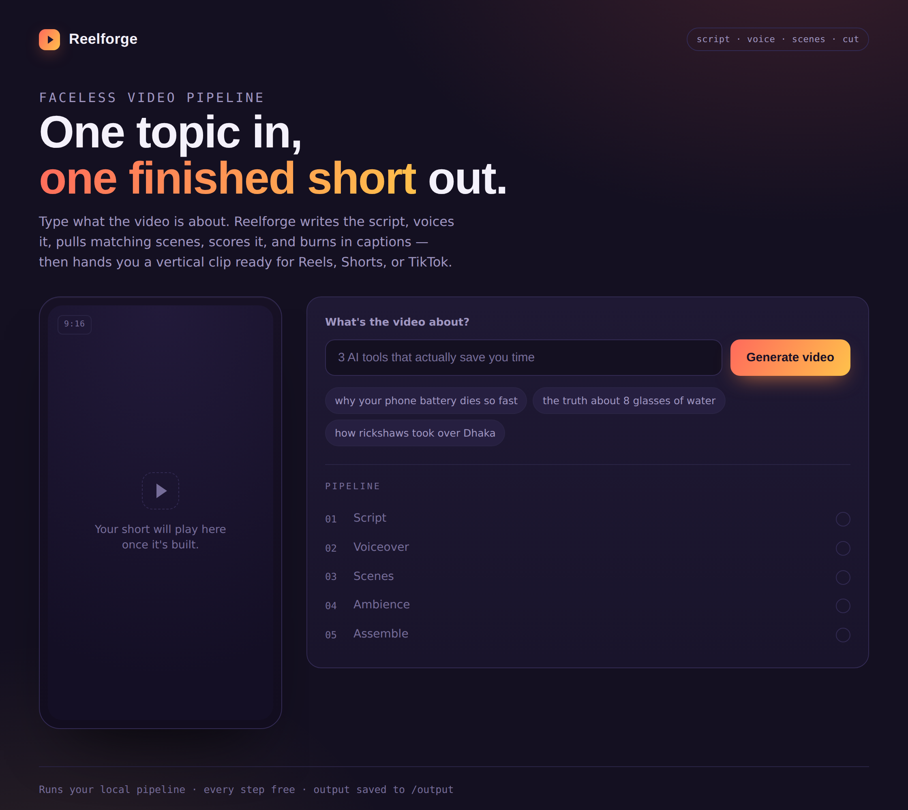

# 🎬 Reelforge - AI Video Pipeline

> Type a topic. Get a finished, captioned, vertical video ready to upload to Reels, Shorts, or TikTok. Every step is free.

<p align="left">
  <a href="https://ShohagMia-reelforge.hf.space"></a>
  
  
</p>

### ▶ Live demo: **https://huggingface.co/spaces/ShohagMia/reelforge**

> The demo runs on a free CPU tier, so it may take a minute to wake from sleep, and each video takes a few minutes to render.



---

Reelforge turns a single sentence into a complete short-form video. It writes the script, voices it, finds matching footage, scores it with background ambience, and burns in synced captions — then hands you an upload-ready `.mp4`. There's a one-command CLI for batch use and a clean web app for point-and-click generation.

The entire pipeline is built on free services. The only real cost is the few minutes it takes to render.

## What it does

Give it a topic like `why your phone battery dies so fast`, and it produces a vertical (1080×1920) video with:

- a hooky, spoken-word script split into timed scenes
- a natural neural voiceover
- a matching stock photo per scene, with a slow Ken Burns zoom
- optional background ambience picked to fit the topic
- bold, word-synced captions and a title hook, burned directly into the video

## How it works

The pipeline runs in five stages, each handled by its own module so they're easy to test and swap:

| # | Stage | Module | Service used |
|---|-------|--------|--------------|
| 1 | Script + scene breakdown | `script_gen.py` | Pollinations (free text model) |
| 2 | Voiceover + caption timing | `voice_gen.py` | edge-tts (Microsoft neural voices) |
| 3 | Scene images | `image_gen.py` | Pexels (free stock photos) |
| 4 | Background ambience | `music_gen.py` | Freesound (optional) |
| 5 | Final assembly + captions | `assemble.py` | moviepy + ffmpeg (local) |

`main.py` orchestrates these for the command line; `app.py` wraps the same steps in a Flask web app with live progress and a download button.

## Tech stack

**Python**, **Flask** (web app), **moviepy** + **ffmpeg** (rendering), **edge-tts** (speech), and the free Pollinations / Pexels / Freesound APIs. The deployed demo runs as a **Docker** container on **Hugging Face Spaces**.

## Run it locally

### 1. Install

```bash
git clone https://github.com/MdShohag07/AI-Video-Pipeline.git
cd reelforge
pip install -r requirements.txt
```

Python 3.10+ is recommended. `imageio-ffmpeg` bundles its own ffmpeg, so you don't need to install ffmpeg separately.

### 2. Add your free API keys

Copy the example env file and fill in your keys:

```bash
cp .env.example .env
```

```env
POLLINATIONS_API_KEY=your_key   # https://pollinations.ai
PEXELS_API_KEY=your_key         # https://www.pexels.com/api/
FREESOUND_API_KEY=your_key      # https://freesound.org/apiv2/apply/  (optional)
```

None of these require payment details to sign up. If you skip the Freesound key, videos are simply made without background ambience.

### 3. Generate a video

**Web app** (recommended):

```bash
python app.py
```

Open `http://127.0.0.1:5000`, type a topic, and hit **Generate**.

**Command line:**

```bash
python main.py "3 AI tools that actually save you time"
```

The finished video lands in `output/<your_topic>.mp4`.

## Configuration

Everything tunable lives in `config.py`:

- `VOICE` — switch language/accent (includes Bangla `bn-BD-…` and Hindi `hi-IN-…` voices; run `edge-tts --list-voices` for the full list)
- `NUM_SCENES` — how many scenes the script is split into
- `ZOOM_FACTOR` — strength of the Ken Burns zoom
- `CAPTION_FONT`, `CAPTION_FONTSIZE`, `CAPTION_MARGIN_V` — caption look and placement
- `MUSIC_VOLUME` — how loud the background sits under the voice

## Deployment

The included `Dockerfile` and the YAML header in the Space README make this deploy to **Hugging Face Spaces** (free CPU tier) out of the box. Push the repo to a Docker Space, set the three API keys as Space **secrets**, and it builds and runs automatically. The same container runs on any Docker host.

## Project structure

```
reelforge/
├── app.py              # Flask web app (live progress + download)
├── main.py             # one-command CLI pipeline
├── config.py           # all settings live here
├── script_gen.py       # 1. script + scene prompts
├── voice_gen.py        # 2. voiceover + caption timing
├── image_gen.py        # 3. scene images
├── music_gen.py        # 4. background ambience (optional)
├── assemble.py         # 5. final render + caption burn-in
├── templates/
│   └── index.html      # web app frontend
├── Dockerfile          # container for deployment
├── requirements.txt
└── .env.example        # template for your API keys
```

## Notes & limitations

- **Rendering is CPU-bound.** A full video takes a few minutes; the final assembly step is the slow part. On free hosting, expect it to be slower than on your own machine.
- **Free services can hiccup.** The Pollinations text model occasionally returns slightly malformed JSON (the code recovers from common cases; otherwise just retry — it's free). edge-tts is an unofficial wrapper around Microsoft's service and can briefly fail; retrying fixes it.
- **This makes faceless content.** Voice, captions, and imagery are all tunable in `config.py` — the more you adjust them, the more it stands out from generic AI output.

## License

Released under the [MIT License](LICENSE) — free to use, modify, and build on.
